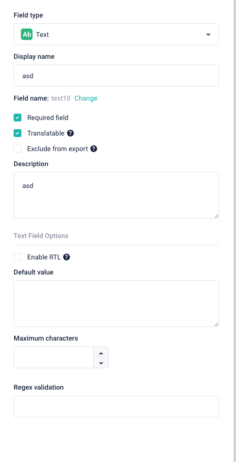

# Storyblok Schema Types

This are typescript types for Storyblok Schemas.

# Example
For official Text Field type



Typescript type looks like

```ts
export interface StoryblokGenericFieldType {
  display_name: string;
  required: boolean;
  translatable: boolean;
  description?: string;
  pos?: number;
}

export interface StoryblokTextFieldType extends StoryblokGenericFieldType {
  type: 'text';
  default_value?: string;
  no_translate?: boolean; // if true, then the translations will not be exported by export translations plugin
  max_length?: number;
  regex?: string;
  rtl?: boolean;
}
```


*Disclaimer: This is done completelly for our in-house purposes. Decided to open source it, becasue maybe anyone else will find it useful :) Please let me know if u will have any problems or issues.
